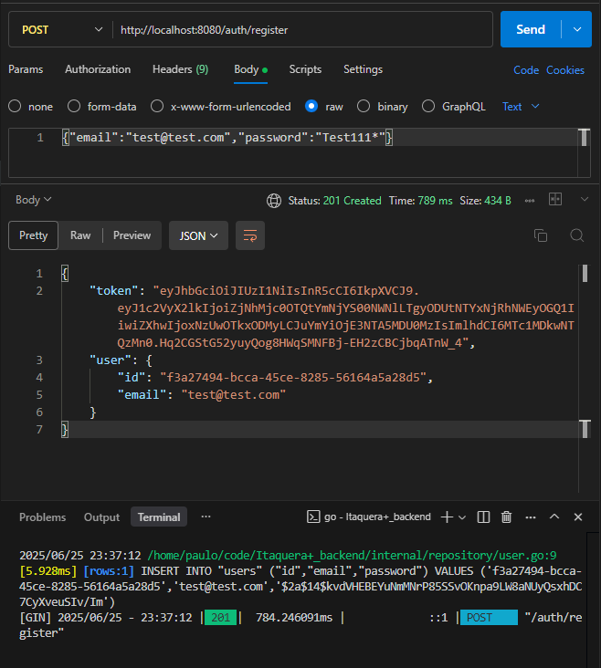
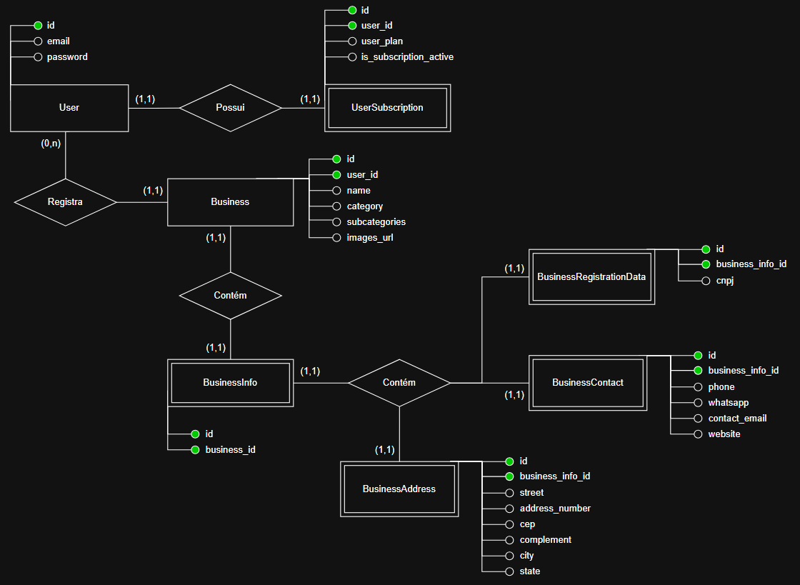
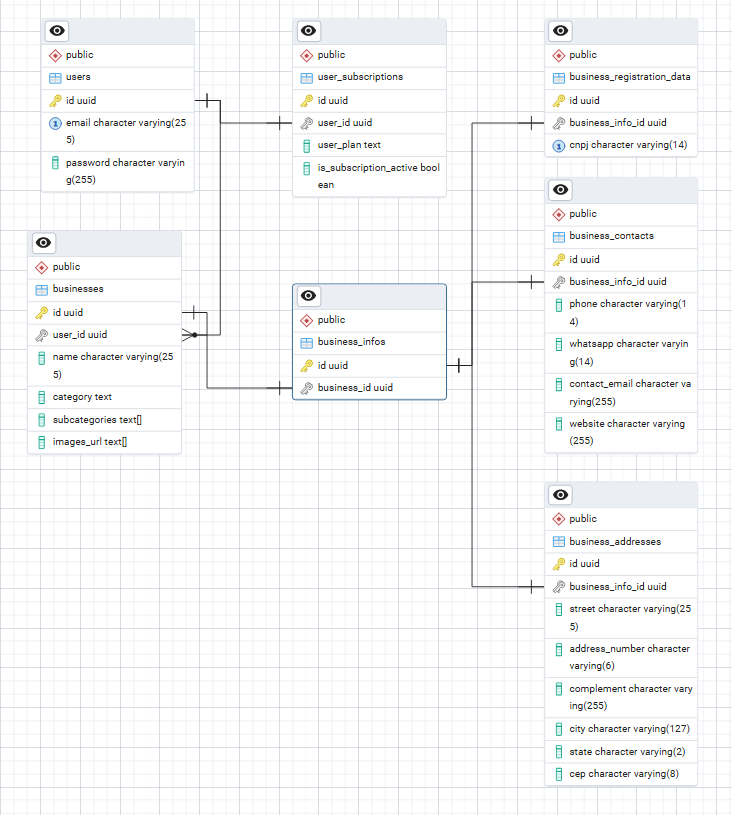

### Experiência Profissional: Banco de Dados Relacional

Trabalho voltado à disciplina de `Experiência Profissional: Banco de Dados Relacional`, contendo em anexo o `modelo físico`, `modelo conceitual`, `modelo lógico` e o `resumo expandido`.

---

#### Modelo físico

    
    <i>
Exemplo do funcionamento do modelo físico
</i>

Na imagem acima é possível ver a criação de um usuário, que é explicada pela seguinte sequência:

1.  No topo está a URL utilizada para fazer o cadastro de usuário;
2.  Logo abaixo está o corpo da requisição, onde são passados os parâmetros (email e password);
3.  Em seguida está a resposta da requisição, que retorna um token JWT para autenticação e também o objeto "user" que foi cadastrado no banco de dados;
4.  E por fim há a tela do terminal com o log de inserção no banco, onde pode-se ver o INSERT realizado para persistir o usuário no banco de dados.

Clique <a href="https://github.com/Paulooo0/relational-db-college-activity/blob/main/modelo-fisico.sql">aqui</a> para acessar o arquivo .sql do modelo físico</a>, que é o suficiente para replicar as tabelas e relações que foram utiizadas

---

#### Modelo conceitual

    
    <i>
Modelo conceitual
</i>

Clique <a href="https://github.com/Paulooo0/relational-db-college-activity/blob/main/modelo-conceitual.png">aqui</a> ou na imagem para acessar o modelo conceitual

---

#### Modelo lógico

    
    <i>
Modelo lógico
</i>

Clique <a href="https://github.com/Paulooo0/relational-db-college-activity/blob/main/modelo-logico.png">aqui</a> ou na imagem para acessar o modelo lógico

---

#### Resumo expandido

Clique <a href="https://github.com/Paulooo0/relational-db-college-activity/blob/main/resumo.docx">aqui</a> para acessar o resumo expandido (formato .docx)
